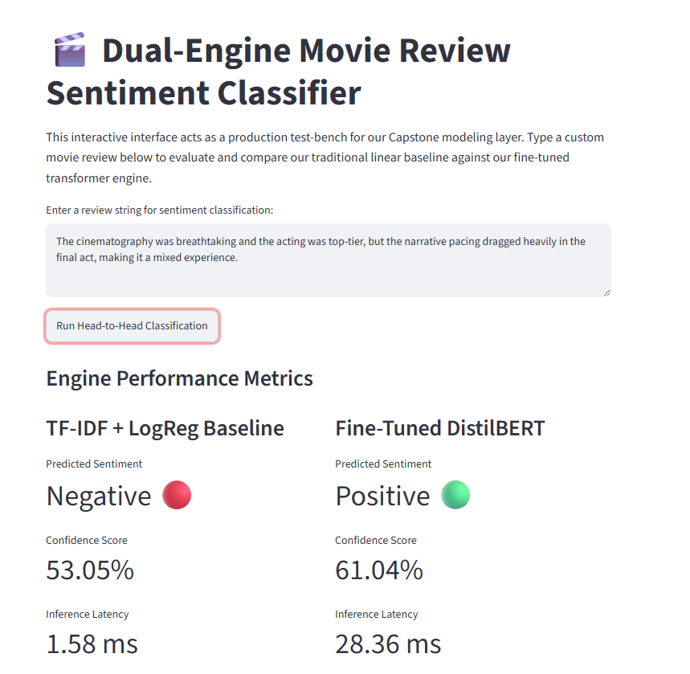

# 🎬 Dual-Engine Movie Review Sentiment Classifier

<p align="center">


</p>

<p align="center">
<a href="https://customersentimentbert-n6emezcfiq7fbm72hqqgbs.streamlit.app">

</a>
</p>

---

## 🚀 Live Demo

👉 **Try the application here**

https://customersentimentbert-n6emezcfiq7fbm72hqqgbs.streamlit.app

---

## 📸 Application Preview

<p align="center">
  
</p>

<p align="center">
Compare a traditional TF-IDF + Logistic Regression model against a fine-tuned DistilBERT Transformer in real time.
</p>

**Example:** The baseline model classifies the review as **Negative**, while DistilBERT recognizes the nuanced sentiment and predicts **Positive**, highlighting the importance of contextual understanding in Natural Language Processing.

---

# 📌 Project Overview

This project compares two fundamentally different approaches to sentiment analysis:

| Engine            | Approach                     |
| ----------------- | ---------------------------- |
| ⚡ Baseline Model  | TF-IDF + Logistic Regression |
| 🧠 Advanced Model | Fine-Tuned DistilBERT        |

Rather than focusing solely on accuracy, this project explores a common machine learning engineering challenge:

> How much additional accuracy is worth the extra computational cost?

The application allows users to submit movie reviews and instantly compare predictions from both models side-by-side.

---

# 🎯 Business Objective

Organizations often face a trade-off between:

* Fast and inexpensive predictions
* More accurate but computationally expensive models

This project serves as a practical benchmark framework for evaluating:

* Accuracy
* Inference latency
* Context understanding
* Deployment complexity
* Production scalability

---

# 🏗️ Solution Architecture

```text
User Review
     │
     ▼
┌─────────────────┐
│  Streamlit UI   │
└─────────────────┘
     │
     ├───────────────┐
     ▼               ▼

┌────────────┐   ┌──────────────┐
│ Logistic   │   │ DistilBERT   │
│ Regression │   │ Transformer  │
└────────────┘   └──────────────┘

     │               │
     ▼               ▼

 Sentiment       Sentiment
 Prediction      Prediction

     │               │
     └──────┬────────┘
            ▼

     Side-by-Side Comparison
```

---

# 📂 Project Structure

```text
customer_sentiment_bert/
│
├── data/
│   └── processed/
│
├── models/
│   └── baseline_logreg.pkl
│
├── notebooks/
│   ├── 01_eda_preprocessing.ipynb
│   ├── 02_baseline_model.ipynb
│   └── 03_bert_finetuning.ipynb
│
├── src/
│   ├── dataset.py
│   ├── model.py
│   └── __init__.py
│
├── images/
│   └── app_preview.png
│
├── requirements.txt
│
└── streamlit_app.py
```

---

# 🔍 Dataset

### IMDB Movie Review Dataset

The project uses the IMDB sentiment analysis dataset containing positive and negative movie reviews.

The dataset provides:

* Real-world user-generated text
* Balanced sentiment classes
* Long-form review content
* Strong benchmark value for NLP evaluation

---

# ⚙️ Development Workflow

## Phase 1 — Environment Setup

Established a structured project architecture separating:

* Data assets
* Source code
* Experiments
* Trained models
* Deployment components

---

## Phase 2 — Data Cleaning & Preprocessing

Text preprocessing included:

* HTML tag removal
* Noise reduction
* Lowercasing
* Special character removal
* Whitespace normalization

Output datasets:

```text
train_clean.csv
val_clean.csv
test_clean.csv
```

This ensured reproducibility and prevented target leakage.

---

## Phase 3 — Traditional Machine Learning Baseline

### Feature Engineering

TF-IDF Vectorization

* Unigrams
* Bigrams

### Classification Model

```text
Logistic Regression
```

### Strengths

✅ Extremely fast

✅ Lightweight deployment

✅ Minimal infrastructure requirements

### Limitations

❌ Limited contextual understanding

❌ Sensitive to word order

❌ Struggles with sarcasm and sentiment shifts

---

## Phase 4 — Transformer Fine-Tuning

### Model Selected

```text
distilbert-base-uncased
```

DistilBERT was selected because it:

* Retains approximately 95% of BERT performance
* Uses roughly 40% fewer parameters
* Delivers faster inference than full BERT

### Training Stack

* PyTorch
* Hugging Face Transformers
* Trainer API

### Benefits

✅ Context-aware predictions

✅ Better negation handling

✅ Stronger sentiment reasoning

✅ Improved classification accuracy

---

## Phase 5 — Cloud Model Hosting

Large transformer models exceed GitHub's repository limits.

To address this:

### GitHub Stores

* Source code
* Notebooks
* Configuration files

### Hugging Face Stores

* Model weights
* Tokenizer assets
* Model configurations

Benefits:

* Smaller repository size
* Faster cloning
* Cleaner version control history

---

## Phase 6 — Deployment

### Frontend

Streamlit

### Model Hosting

Hugging Face Hub

### Infrastructure

Streamlit Community Cloud

Deployment flow:

```text
App Launch
     ↓
Load Model from HF Hub
     ↓
Cache Locally
     ↓
Serve Predictions
```

---

# 📊 Performance Benchmark

| Metric                | Logistic Regression | DistilBERT  |
| --------------------- | ------------------- | ----------- |
| Architecture          | TF-IDF + LR         | Transformer |
| Inference Latency     | ~1.5 ms             | ~25 ms      |
| Context Understanding | Low                 | High        |
| Negation Handling     | Weak                | Strong      |
| Sarcasm Detection     | Poor                | Better      |
| Deployment Cost       | Low                 | Higher      |

---

# 📈 Model Evaluation Results

Both models were evaluated on unseen test data.

| Metric                | TF-IDF + Logistic Regression | Fine-Tuned DistilBERT |
| --------------------- | ---------------------------- | --------------------- |
| Test Accuracy         | 88.92%                       | **91.08%**            |
| Validation Accuracy   | 89.32%                       | **91.54%**            |
| Inference Speed       | ~1.5 ms                      | ~25 ms                |
| Context Understanding | Limited                      | Advanced              |
| Negation Handling     | Weak                         | Strong                |
| Overall Performance   | Good                         | Better                |

---

## 🔍 Key Findings

### Traditional ML Remains Competitive

The TF-IDF + Logistic Regression baseline achieved an impressive **88.92% accuracy**, demonstrating why traditional NLP models remain attractive for low-latency production environments.

### Transformers Deliver Better Contextual Understanding

The fine-tuned DistilBERT model achieved **91.08% test accuracy**, outperforming the baseline by **2.16 percentage points** on unseen reviews.

### Accuracy vs Latency Trade-Off

| Consideration         | Logistic Regression | DistilBERT     |
| --------------------- | ------------------- | -------------- |
| Speed                 | ✅ Excellent         | ⚠ Slower       |
| Compute Cost          | ✅ Low               | ⚠ Higher       |
| Context Understanding | ⚠ Limited           | ✅ Strong       |
| Scalability           | ✅ Easy              | ⚠ More Complex |
| Accuracy              | Good                | Better         |

This demonstrates that model selection should be driven by business requirements rather than accuracy alone.

---

# 🛠 Skills Demonstrated

### Machine Learning

* TF-IDF Vectorization
* Logistic Regression
* Feature Engineering
* Model Evaluation

### Deep Learning

* DistilBERT
* Transfer Learning
* Transformer Fine-Tuning
* PyTorch

### Natural Language Processing

* Text Cleaning
* Tokenization
* Sentiment Analysis
* Text Classification

### Deployment & MLOps

* Streamlit
* Hugging Face Hub
* GitHub
* Model Serialization
* Cloud Deployment

### Software Engineering

* Modular Project Structure
* Reproducible Pipelines
* Version Control
* Environment Management

---

# 💡 Real-World Applications

This solution can be adapted for:

* Customer Feedback Analysis
* Product Reviews
* Social Media Monitoring
* Brand Sentiment Tracking
* Employee Feedback Analysis
* Support Ticket Classification

---

# 🚀 Run Locally

### Clone Repository

```bash
git clone https://github.com/ak0959/customer_sentiment_bert.git

cd customer_sentiment_bert
```

### Install Dependencies

```bash
pip install -r requirements.txt
```

### Launch Application

```bash
streamlit run streamlit_app.py
```

---

## 📚 Additional Documentation

### Deep Dive Analysis

- [Adversarial Testing & Error Analysis](docs/adversarial_testing.md)

A structured evaluation of both sentiment engines using sarcasm, negation, metaphorical language, counterfactual statements, and other challenging edge cases to better understand model behavior beyond traditional accuracy metrics.

---

# 🔮 Future Enhancements

* Emotion Detection
* Multi-Class Sentiment Classification
* Explainable AI (SHAP/LIME)
* Docker Deployment
* CI/CD Pipelines
* Model Monitoring Dashboard
* A/B Testing Framework

---

# 👨‍💻 Author

### Amit Kadia

Senior Programme Manager | AI & Data Analytics Enthusiast

Passionate about combining business problem-solving with practical AI and machine learning solutions.

---

## ⭐ If you found this project useful, consider giving it a star.
