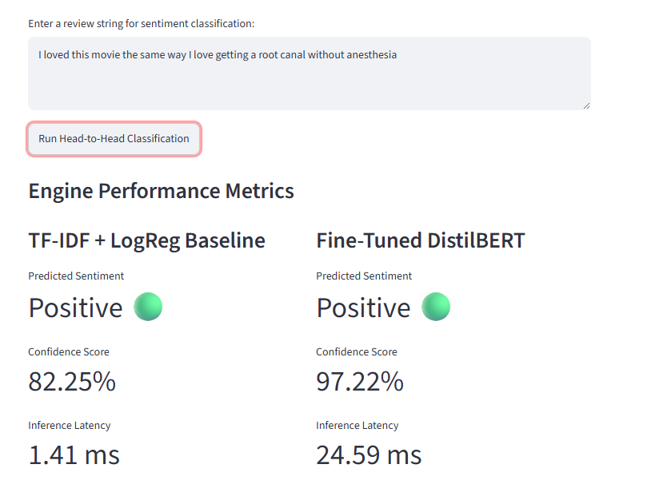
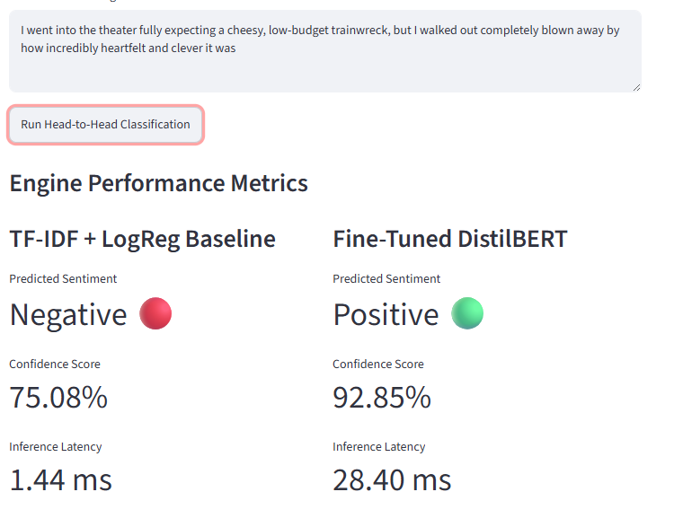
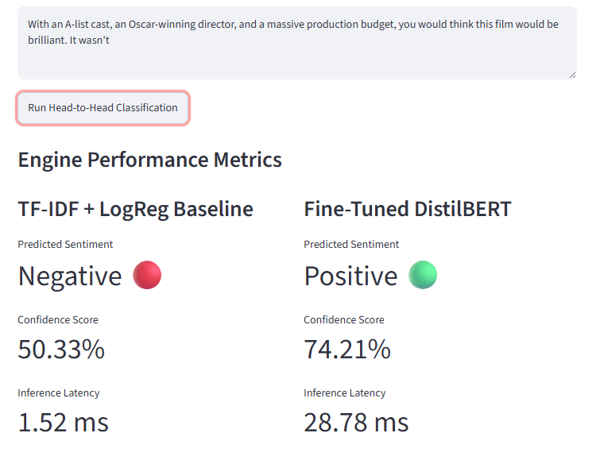
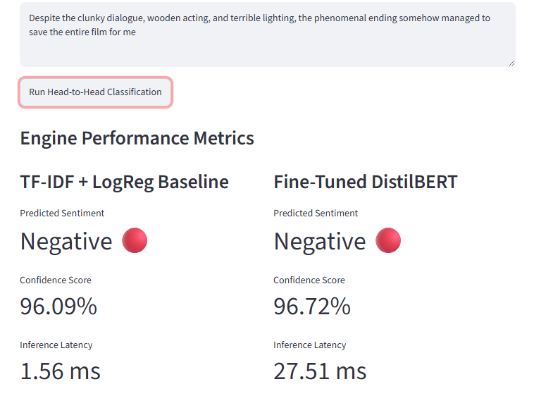
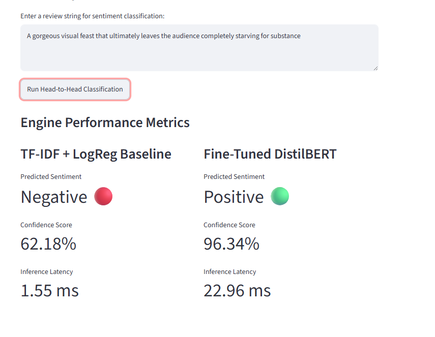

# 🧪 Adversarial Testing & Error Analysis

## Understanding How Traditional NLP and Transformer Models Behave Beyond Accuracy Scores

---

## Why This Evaluation Matters

Most NLP projects stop at reporting accuracy scores.

While overall accuracy is important, it rarely explains **how models behave when language becomes ambiguous, sarcastic, metaphorical, or structurally complex.**

To better understand the strengths and weaknesses of both sentiment engines, I designed a series of deliberately challenging test cases covering:

* Sarcasm
* Sentiment Reversals
* Negation
* Mixed Sentiment
* Recovery Narratives
* Backhanded Praise
* Metaphorical Language
* Counterfactual Reasoning

The objective was simple:

> Understand where the models fail, not just where they succeed.

---

# 📊 Executive Summary

| #  | Test Case                     | Category                 | TF-IDF + LogReg | DistilBERT | Expected |
| -- | ----------------------------- | ------------------------ | --------------- | ---------- | -------- |
| 1  | Root Canal Without Anesthesia | Sarcasm                  | ❌               | ❌          | Negative |
| 2  | Waste $200M Budget            | Structural Criticism     | ✅               | ✅          | Negative |
| 3  | Trainwreck Expectation        | Expectation Reversal     | ❌               | ✅          | Positive |
| 4  | It Wasn't                     | Late Negation            | ✅               | ❌          | Negative |
| 5  | Masterpiece → Disaster        | Mixed Sentiment          | ✅               | ✅          | Negative |
| 6  | Saved The Film                | Recovery Narrative       | ❌               | ❌          | Positive |
| 7  | Devoid of Charm               | Negation & Criticism     | ✅               | ✅          | Negative |
| 8  | Rainy Tuesday Comedy          | Backhanded Praise        | ✅               | ✅          | Negative |
| 9  | Visual Feast                  | Metaphorical Language    | ✅               | ❌          | Negative |
| 10 | Movie of the Year             | Counterfactual Reasoning | ✅               | ✅          | Negative |

---

# 🏆 Overall Scorecard

| Model                        | Correct | Incorrect |
| ---------------------------- | ------- | --------- |
| TF-IDF + Logistic Regression | 7       | 3         |
| Fine-Tuned DistilBERT        | 7       | 3         |

Interestingly, both models achieved the same score across the adversarial test suite, but they failed in **different ways**.

This highlights an important machine learning principle:

> A higher benchmark accuracy does not guarantee superior performance in every real-world scenario.

---

# 🔍 Key Examples

<strong>Test 1 — Sarcasm (Both Models Failed)</strong>

### Input

> "I loved this movie the same way I love getting a root canal without anesthesia."

### Expected

Negative

### Observation

Both models interpreted the statement literally and classified it as positive.

### Takeaway

Sarcasm remains difficult when understanding depends on real-world knowledge rather than explicit negative vocabulary.

---

<strong>Test 3 — Expectation Reversal (DistilBERT Wins)</strong>

### Input

> "I went into the theater fully expecting a cheesy, low-budget trainwreck, but I walked out completely blown away by how incredibly heartfelt and clever it was."

### Expected

Positive

### Observation

The TF-IDF baseline focused heavily on negative words such as *cheesy* and *trainwreck*.

DistilBERT correctly interpreted the sentiment reversal introduced by the word **but**.

### Takeaway

Transformers excel when sentiment changes across a sentence.

---

<strong>Test 4 — Late Negation (Baseline Wins)</strong>

### Input

> "With an A-list cast, an Oscar-winning director, and a massive production budget, you would think this film would be brilliant. It wasn't."

### Expected

Negative

### Observation

DistilBERT was overwhelmed by the dense positive language and missed the brief negation at the end.

### Takeaway

Even advanced contextual models can struggle when a short negative phrase must override a large amount of positive context.

---

<strong>Test 6 — Recovery Narrative (Both Models Failed)</strong>

### Input

> "Despite the clunky dialogue, wooden acting, and terrible lighting, the phenomenal ending somehow managed to save the entire film for me."

### Expected

Positive

### Observation

Both models focused heavily on the concentration of negative language and ignored the positive conclusion.

### Takeaway

Large amounts of negative vocabulary can overpower later sentiment reversals.

---

<strong>Test 9 — Metaphorical Language (Most Surprising Result)</strong>

### Input

> "A gorgeous visual feast that ultimately leaves the audience completely starving for substance."

### Expected

Negative

### Observation

The baseline correctly classified the review as negative.

DistilBERT incorrectly classified it as positive with **96.34% confidence**.

### Takeaway

Higher confidence does not always imply greater correctness.

Metaphorical language remains challenging even for transformer-based models.

---

# 📌 What the Evaluation Revealed

## TF-IDF + Logistic Regression

### Strengths

* Extremely fast inference
* Strong performance on explicit criticism
* Competitive when negative vocabulary is obvious
* Surprisingly robust on several edge cases

### Weaknesses

* No understanding of sentence structure
* Struggles with sentiment transitions
* Easily fooled by sarcasm
* Limited contextual reasoning

---

## Fine-Tuned DistilBERT

### Strengths

* Better contextual understanding
* Strong handling of sentiment reversals
* Better performance on structurally complex reviews
* Superior understanding of narrative flow

### Weaknesses

* Still vulnerable to sarcasm
* Can miss short negations
* Occasionally struggles with metaphorical language
* High confidence does not guarantee correctness

---

# 🎯 Final Conclusion

This evaluation demonstrates that model accuracy alone does not fully describe model behavior.

While DistilBERT achieved higher benchmark accuracy on the IMDB dataset, adversarial testing revealed that both architectures possess distinct strengths and weaknesses.

The TF-IDF baseline remained surprisingly competitive when sentiment was expressed through explicit vocabulary patterns, while DistilBERT excelled when contextual understanding and sentence structure became important.

The most valuable insight from this exercise was not identifying which model performed better.

It was understanding **how and why each model fails.**

That understanding is often more useful in production environments than accuracy scores alone.

